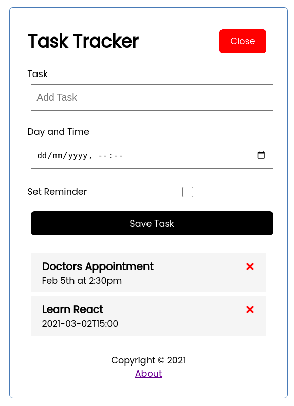

# React Task Tracker

Code along for Traversy Media's [React JS Crash Course 2021](https://www.youtube.com/watch?v=w7ejDZ8SWv8)

The app is a simple single page Task list 
- toggle button to show and display the add a task 
- delete icon to remove the task
- double click to highlight as a reminder 



## Installation

This is a React app, build from Create React App. To install the app locally:

Install the dependencies:

```shell
yarn
```

## Json server

A local testing server has been configured called `json-server` and a script has been added to the **package.json**.

To start the server run:

```shell
yarn server
```

This will start the json server on port 5000 (configured in [package.json](package.json)). It will serve **items** from 
**db.json**. Then start the app, see below.

## Getting Started with Create React App

This project was bootstrapped with [Create React App](https://github.com/facebook/create-react-app).

### Available Scripts

In the project directory, you can run:

#### `yarn start`

Runs the app in the development mode.\
Open [http://localhost:3000](http://localhost:3000) to view it in the browser.

The page will reload if you make edits.\
You will also see any lint errors in the console.

To use docker, a docker-compose.yml has been configured, to run the same start command:

```shell
docker-compose up -d web
```

#### `yarn build`

Builds the app for production to the `build` folder.\
It correctly bundles React in production mode and optimizes the build for the best performance.

The build is minified and the filenames include the hashes.\
Your app is ready to be deployed!

See the section about [deployment](https://facebook.github.io/create-react-app/docs/deployment) for more information.

To run build using docker, under the current users account:

```shell
docker-compose run -u $(id -u):$(id -g) build
```

#### `yarn eject`

**Note: this is a one-way operation. Once you `eject`, you can’t go back!**

If you aren’t satisfied with the build tool and configuration choices, you can `eject` at any time. This command will remove the single build dependency from your project.

Instead, it will copy all the configuration files and the transitive dependencies (webpack, Babel, ESLint, etc) right into your project so you have full control over them. All of the commands except `eject` will still work, but they will point to the copied scripts so you can tweak them. At this point you’re on your own.

You don’t have to ever use `eject`. The curated feature set is suitable for small and middle deployments, and you shouldn’t feel obligated to use this feature. However we understand that this tool wouldn’t be useful if you couldn’t customize it when you are ready for it.

### Learn More

You can learn more in the [Create React App documentation](https://facebook.github.io/create-react-app/docs/getting-started).

To learn React, check out the [React documentation](https://reactjs.org/).

#### Code Splitting

This section has moved here: [https://facebook.github.io/create-react-app/docs/code-splitting](https://facebook.github.io/create-react-app/docs/code-splitting)

#### Analyzing the Bundle Size

This section has moved here: [https://facebook.github.io/create-react-app/docs/analyzing-the-bundle-size](https://facebook.github.io/create-react-app/docs/analyzing-the-bundle-size)

#### Making a Progressive Web App

This section has moved here: [https://facebook.github.io/create-react-app/docs/making-a-progressive-web-app](https://facebook.github.io/create-react-app/docs/making-a-progressive-web-app)

#### Advanced Configuration

This section has moved here: [https://facebook.github.io/create-react-app/docs/advanced-configuration](https://facebook.github.io/create-react-app/docs/advanced-configuration)

#### Deployment

This section has moved here: [https://facebook.github.io/create-react-app/docs/deployment](https://facebook.github.io/create-react-app/docs/deployment)

#### `yarn build` fails to minify

This section has moved here: [https://facebook.github.io/create-react-app/docs/troubleshooting#npm-run-build-fails-to-minify](https://facebook.github.io/create-react-app/docs/troubleshooting#npm-run-build-fails-to-minify)

### Interactive node docker container

Open ports 8000, run under the currently logged-in user account, mount the volume from the current directory to /app,
set the working directory to /app and open an interactive shell, remove the image on exit

```shell
docker run -p:8000:8000 -u $(id -u):$(id -g) -v $(pwd):/app -w /app --rm -it node:14.15.3-alpine /bin/sh
```

To run as admin in an existing container:

```shell
docker ps
```

```text
CONTAINER ID        IMAGE                 COMMAND                  CREATED             STATUS              PORTS                    NAMES
3a891fb4534f        node:14.15.3-alpine   "docker-entrypoint.s…"   10 seconds ago      Up 9 seconds        0.0.0.0:8000->8000/tcp   trusting_benz
```

Note the name of the running container, e.g. **trusting_benz**

```sh
docker exec -u 0:0 -w /app -it trusting_benz /bin/sh
```

Note, any file changes to **/app** directory will be owned by the root user, on Linux this may need to be corrected, 
once the docker container has been exited, run this to restore ownership to the currently signed-in user:

```shell
sudo chown -R $(id -u):$(id -g) ./
```
